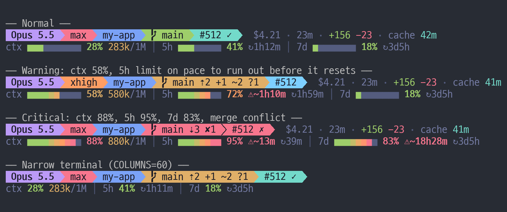
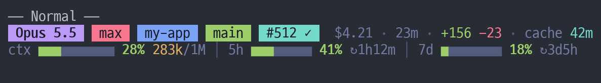
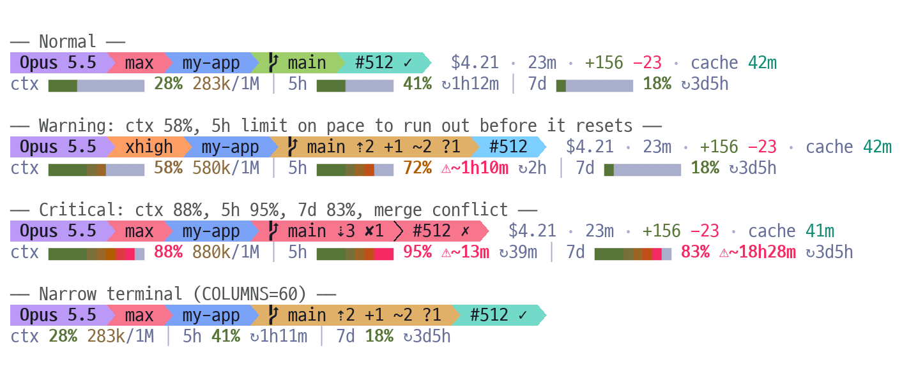

# claude-code-statusline

[Claude Code](https://code.claude.com/docs/en/statusline)용 2줄 파워라인 status line입니다.
윗줄에는 모델, effort, 저장소, git과 PR 상태가 나오고, 아랫줄에는 컨텍스트와 요금제 사용 한도를
색으로 구분한 게이지가 나옵니다.



[English](README.md)

## 표시하는 정보

**1줄**: 파워라인 화살표로 이어진 칩과 세션 통계를 보여 줍니다.

| 칩 | 내용 | 색 |
|---|---|---|
| 모델 | `Opus 5.5` (컨텍스트 크기 표기는 뺍니다) | Opus 보라, Sonnet 하늘, Haiku 청록, Fable 주황 |
| effort | `max`, `xhigh`, `high`, `medium`, `low`, fast 모드이면 `fast` 추가 | 빨강, 주황, 노랑, 청록, 회색 |
| 디렉터리 | 저장소 이름, 체크아웃 루트 아래 경로, 브랜치와 이름이 다른 워크트리 이름 | 파랑 |
| git | 브랜치, `⇡` ahead, `⇣` behind, `✘` 충돌, `+` 스테이징, `~` 수정, `?` 미추적 | 깨끗하면 초록, 변경이 있으면 노랑, 충돌이 있으면 빨강 |
| PR / MR | GitHub는 `#512`, GitLab은 `!512`. Cmd/Ctrl+클릭하면 열립니다 | 승인 청록, 변경 요청 빨강, 리뷰 대기 하늘, 초안 회색 |

칩 뒤에는 세션 비용, 세션 시간, 추가·삭제한 줄 수, 프롬프트 캐시가 만료되기까지 남은 시간이 붙습니다.

**2줄**: 게이지를 보여 줍니다.

- `ctx`: 사용한 컨텍스트 비율과 토큰 수(`283k/1M`)입니다. 토큰 수는 20만을 넘으면 노란색으로 바뀝니다.
- `5h` / `7d`: 요금제 사용 한도(Pro, Max 요금제)와 리셋까지 남은 시간(`↻1h12m`)입니다.
- `⚠~45m`: 지금까지의 평균 속도로 계속 쓰면 리셋 전에 약 45분 뒤 한도가 찬다는 뜻입니다.
- 막대는 칸마다 초록에서 빨강으로 칠합니다. 퍼센트 숫자는 50%에서 노랑, 65%에서 주황, 80%에서 빨강이
  됩니다.

터미널 폭이 좁으면 막대부터 줄입니다. 그다음 캐시, 줄 수, 세션 시간, 비용, PR, effort 순서로 빼고,
마지막에 디렉터리와 브랜치 이름을 줄입니다.

## 설치

필요한 것: Claude Code, bash 3.2 이상, [jq](https://jqlang.org)(최신 macOS에는 기본 포함), git(선택).

```bash
git clone https://github.com/m16khb-org/claude-code-statusline.git
cd claude-code-statusline
./install.sh           # 폰트에 파워라인 기호가 없으면 ./install.sh --plain
```

설치 스크립트는 `statusline.sh`를 `~/.claude/claude-code-statusline/`에 복사합니다. `$CLAUDE_CONFIG_DIR`이
설정되어 있으면 그 폴더를 씁니다. 그다음 `settings.json`을 백업하고 `statusLine` 항목을 설정합니다.

```json
"statusLine": {
  "type": "command",
  "command": "bash \"/Users/you/.claude/claude-code-statusline/statusline.sh\"",
  "refreshInterval": 30
}
```

Claude Code는 변경 사항을 바로 반영합니다. 업데이트는 `git pull && ./install.sh`로 합니다. 제거하려면
`./uninstall.sh`를 실행하세요. 설치 전에 쓰던 statusLine을 되돌려 놓습니다.

Claude Code를 켜지 않고도 모든 상태를 미리 볼 수 있습니다.

```bash
bash ~/.claude/claude-code-statusline/statusline.sh --demo
```

## 폰트, 색, 테마

- **파워라인 기호**(U+E0A0, U+E0B0, U+E0B1)는 [Nerd Font](https://www.nerdfonts.com)를 쓰거나, VS Code의
  xterm.js 기반 터미널처럼 이 기호를 직접 그리는 터미널이어야 제대로 보입니다. 네모로 깨지면
  `./install.sh --plain`으로 다시 설치하세요. 칩이 떨어진 배지 모양으로 바뀝니다.

  

- **색**: `COLORTERM`이 `truecolor`나 `24bit`이면 24비트 색을 쓰고, 아니면 가장 가까운 256색으로 바꿉니다.
- **테마**: macOS 외관 설정을 따라 어두운 배경에는 Tokyo Night, 밝은 배경에는 Tokyo Night Day 팔레트를
  씁니다. 다른 운영체제에서는 다크가 기본입니다.



## 설정

`settings.json`의 command 앞에 환경 변수를 붙입니다. 예:
`"command": "STATUSLINE_THEME=light bash \"/Users/you/.claude/claude-code-statusline/statusline.sh\""`

| 변수 | 값 | 기본값 |
|---|---|---|
| `STATUSLINE_THEME` | `dark`, `light` | macOS 외관 설정, 그 밖에는 `dark` |
| `STATUSLINE_GLYPHS` | `powerline`, `plain` | `powerline` |
| `STATUSLINE_COLORS` | `truecolor`, `256` | `COLORTERM` 값에 따름 |

## 속도

한 번 그리는 데 20~40ms가 걸립니다. 세션 JSON은 `jq`를 한 번만 호출해 읽습니다. `git status`는
백그라운드에서 실행하고 결과를 5초 동안 캐시하므로, 저장소가 느려도 화면 갱신이 늦어지지 않습니다.
Claude Code는 다음 갱신이 오면 실행 중인 스크립트를 취소하기 때문에, 스크립트가 느리면 갱신을 놓치게 됩니다.

## 개발

```bash
python3 test/test_statusline.py                      # 렌더링 동작
python3 test/test_install.py                          # install.sh, uninstall.sh
TEST_BASH=/bin/bash python3 test/test_statusline.py   # macOS 기본 bash 3.2
```

테스트는 `STATUSLINE_GIT_RAW`로 `git status --porcelain=v2 --branch` 출력을 주입하므로 실제 저장소에
의존하지 않습니다. 스크린샷은 `tools/render_png.py`로 만들며, Pillow와 고정폭 폰트가 필요합니다.

## 라이선스

[MIT](LICENSE)
